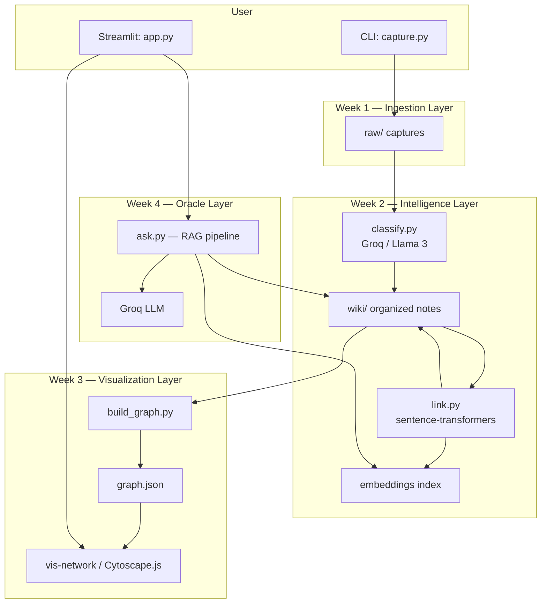
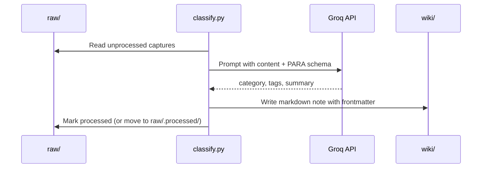
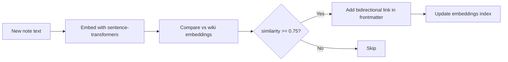
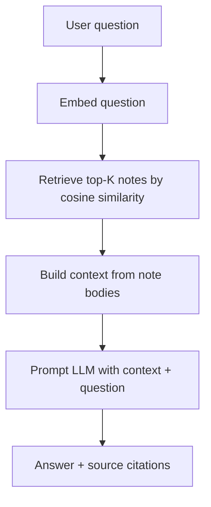
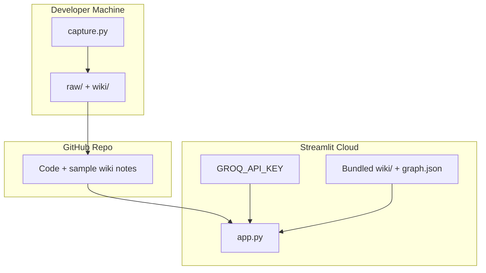
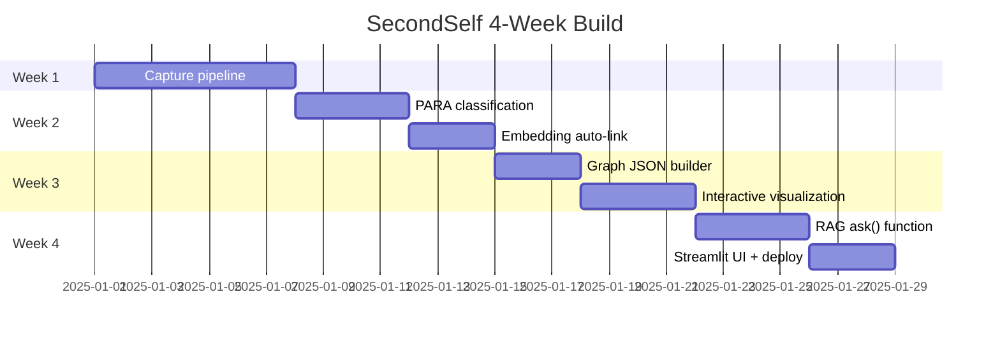

# SecondSelf — Detailed System Architecture

This document describes how to build **SecondSelf**: a personal AI second brain that captures knowledge, organizes it automatically, visualizes it as a graph, and answers questions from your own notes.

---

## 1. System Vision

SecondSelf is a **local-first knowledge pipeline** with a **web UI** on top. It is not a traditional notes app or a generic chatbot — it is a closed loop:

```
Capture → Classify → Link → Graph → Ask → (Capture again)
```

| Layer | Responsibility |
|-------|----------------|
| **Ingestion** | Accept any input (text, URL, file) into a canonical raw format |
| **Intelligence** | LLM classification + embedding-based linking |
| **Knowledge Store** | Structured wiki notes with metadata and cross-links |
| **Visualization** | Force-directed graph from note relationships |
| **Retrieval** | RAG (Retrieval-Augmented Generation) over your wiki |
| **Presentation** | Streamlit app combining graph + Q&A |
| **Deployment** | Public URL via Streamlit Cloud / Hugging Face Spaces |

---

## 2. High-Level Architecture



---

## 3. Repository Structure (Expanded)

```text
secondself/
├── raw/                          # Immutable capture inbox
│   └── {timestamp}_{uuid}/
│       ├── meta.json             # id, timestamp, type, source
│       └── content.*             # note text, downloaded HTML, or file copy
│
├── wiki/                         # Processed, linked knowledge base
│   ├── Projects/
│   ├── Areas/
│   ├── Resources/
│   ├── Archives/
│   └── .index/
│       ├── embeddings.pkl        # or .npy + id mapping
│       └── note_registry.json    # id → path, metadata
│
├── data/
│   └── graph.json                # nodes + edges for visualization
│
├── static/                       # JS graph assets (if not inline in Streamlit)
│   └── graph.html
│
├── src/                          # Optional: package modules (recommended)
│   ├── __init__.py
│   ├── capture.py
│   ├── classify.py
│   ├── link.py
│   ├── build_graph.py
│   ├── ask.py
│   ├── models.py                 # shared dataclasses / schemas
│   └── config.py                 # paths, thresholds, API keys
│
├── app.py                        # Streamlit entry point
├── requirements.txt
├── .env.example                  # GROQ_API_KEY, etc.
├── .gitignore
└── README.md
```

The problem statement uses flat scripts (`capture.py`, `classify.py`, …). Either layout works; a `src/` package scales better as the project grows.

---

## 4. Data Models

### 4.1 Raw Capture (`raw/{capture_id}/`)

Every capture gets a **unique ID** and **ISO timestamp** at creation time.

```json
// meta.json
{
  "id": "20250728_143022_a1b2c3",
  "timestamp": "2025-07-28T14:30:22+05:30",
  "type": "note | link | file",
  "source": "cli | streamlit",
  "original_filename": "optional.pdf",
  "content_path": "content.md"
}
```

**Content storage by type:**

| Type | Storage |
|------|---------|
| Note | `content.md` (plain text or markdown) |
| Link | `content.md` (URL + fetched title/excerpt if available) |
| File | Original file copied + optional `content.md` text extraction |

### 4.2 Wiki Note (`wiki/{PARA}/{slug}.md`)

After classification, each raw capture becomes a wiki note:

```markdown
---
id: 20250728_143022_a1b2c3
para: Resources
tags: [python, ml, embeddings]
summary: One-line summary from LLM
created: 2025-07-28T14:30:22+05:30
links: [20250727_091500_x9y8z7, 20250725_120000_m4n5o6]
embedding_id: 42
---

# Title (from summary or first line)

Full note body...
```

**PARA folders:**

| Category | Meaning |
|----------|---------|
| **Projects** | Active work with a deadline |
| **Areas** | Ongoing responsibilities |
| **Resources** | Topics of interest / reference |
| **Archives** | Inactive or completed items |

### 4.3 Graph Model (`graph.json`)

```json
{
  "nodes": [
    {
      "id": "20250728_143022_a1b2c3",
      "label": "One-line summary",
      "para": "Resources",
      "tags": ["python", "ml"],
      "content_preview": "First 200 chars...",
      "group": "Resources"
    }
  ],
  "edges": [
    {
      "source": "20250728_143022_a1b2c3",
      "target": "20250727_091500_x9y8z7",
      "weight": 0.87,
      "type": "semantic_similarity"
    }
  ]
}
```

### 4.4 Embeddings Index

```python
# In-memory / persisted structure
{
  "model": "all-MiniLM-L6-v2",
  "vectors": np.ndarray,      # shape (N, 384)
  "ids": ["note_id_1", ...],  # parallel to row index
  "updated_at": "ISO timestamp"
}
```

---

## 5. Component Architecture (By Week)

### Week 1 — The Archivist: Capture Pipeline

**Module:** `capture.py`

**Responsibilities:**
- Parse CLI args: `--note`, `--link`, `--file`
- Generate `{timestamp}_{short_uuid}` ID
- Write `meta.json` + content to `raw/`
- Optionally trigger downstream pipeline (Week 2+)

**Interface:**

```python
def capture_note(text: str) -> str: ...
def capture_link(url: str) -> str: ...
def capture_file(path: str) -> str: ...
def capture(input_type, content) -> CaptureResult: ...
```

**CLI examples:**

```bash
python capture.py --note "Idea about RAG pipelines"
python capture.py --link "https://example.com/article"
python capture.py --file "./report.pdf"
```

**Design decisions:**
- **Immutable raw layer** — never edit `raw/`; all processing writes to `wiki/`
- **Folder-per-capture** — avoids filename collisions and keeps metadata beside content
- **Idempotent IDs** — timestamp + UUID ensures uniqueness

---

### Week 2 — The Librarian: Classification + Linking

#### 2.1 Auto-Classify — `classify.py`

**Flow:**



**LLM prompt structure:**

```
System: You classify notes using PARA (Projects, Areas, Resources, Archives).
Return JSON: { "para": "...", "tags": [...], "summary": "..." }

User: <capture content>
```

**Interface:**

```python
def classify_capture(capture_id: str) -> WikiNote: ...
def classify_all_unprocessed() -> list[WikiNote]: ...
def parse_llm_response(text: str) -> ClassificationResult: ...
```

**Groq integration:**
- Model: `llama-3.1-8b-instant` or similar free tier
- API key via `GROQ_API_KEY` environment variable
- Retry + JSON validation on LLM output

#### 2.2 Auto-Link — `link.py`

**Flow:**



**Interface:**

```python
def embed_text(text: str) -> np.ndarray: ...
def load_embedding_index() -> EmbeddingIndex: ...
def find_related(note_id: str, top_k: int = 5) -> list[tuple[str, float]]: ...
def link_note(note_id: str, threshold: float = 0.75) -> list[str]: ...
def process_all_notes() -> None: ...
```

**Key parameters:**

| Parameter | Suggested default | Purpose |
|-----------|-------------------|---------|
| `SIMILARITY_THRESHOLD` | 0.72–0.80 | Min cosine similarity for auto-link |
| `TOP_K` | 5 | Max links per note |
| `EMBEDDING_MODEL` | `all-MiniLM-L6-v2` | Local, free, fast |

**Linking strategy:**
- On each new note: embed → cosine similarity against all existing wiki notes
- Write `links: [...]` in YAML frontmatter (both directions optional but recommended)
- Rebuild embedding index incrementally (append new vector) or batch nightly

---

### Week 3 — The Cartographer: Graph Visualization

#### 3.1 Graph Builder — `build_graph.py`

**Responsibilities:**
- Scan all `wiki/**/*.md` files
- Parse frontmatter: `id`, `summary`, `tags`, `para`, `links`
- Build nodes (one per note) and edges (from `links` array)
- Export `graph.json`

**Interface:**

```python
def parse_wiki_note(path: Path) -> GraphNode: ...
def build_graph(wiki_dir: Path) -> Graph: ...
def export_graph(graph: Graph, output: Path) -> None: ...
```

#### 3.2 Interactive Graph — Frontend in Streamlit

**Options:**

| Library | Pros | Integration |
|---------|------|-------------|
| **vis-network** | Simple, good force layout | `st.components.v1.html()` |
| **Cytoscape.js** | Rich styling, extensions | Same |

**UI features:**
- Force-directed layout (physics simulation)
- Node color by PARA category
- Hover tooltip: summary + tags + content preview
- Click: show full note in sidebar
- Drag, zoom, pan

**Streamlit integration pattern:**

```python
# app.py (partial)
graph_json = load_graph("data/graph.json")
html = render_graph_component(graph_json)  # embed vis-network
st.components.v1.html(html, height=600, scrolling=False)
```

---

### Week 4 — The Oracle: RAG + Deployment

#### 4.1 Ask Function — `ask.py`

**RAG pipeline:**



**Interface:**

```python
def retrieve(question: str, top_k: int = 5) -> list[RetrievedNote]: ...
def synthesize_answer(question: str, context: list[RetrievedNote]) -> Answer: ...
def ask(question: str) -> Answer: ...
```

**Answer object:**

```python
@dataclass
class Answer:
    text: str
    sources: list[str]      # note IDs
    confidence: float       # optional: avg retrieval score
```

**Prompt template:**

```
You answer questions using ONLY the provided notes.
If the notes don't contain enough information, say so.
Cite note IDs when referencing specific facts.

Notes:
---
{retrieved_note_1}
---
{retrieved_note_2}
---

Question: {user_question}
```

#### 4.2 Streamlit App — `app.py`

**Layout:**

```
┌─────────────────────────────────────────────────────┐
│  SecondSelf — Your Personal AI Second Brain         │
├─────────────────────────────────────────────────────┤
│  [ Ask anything...                          ] [Go]  │
│  Answer panel with sources                          │
├─────────────────────────────────────────────────────┤
│  Interactive Knowledge Graph (vis-network)          │
│  [drag · zoom · hover for preview]                  │
├─────────────────────────────────────────────────────┤
│  Sidebar: Capture new note | Rebuild graph | Stats  │
└─────────────────────────────────────────────────────┘
```

**App responsibilities:**
- Load `graph.json` and render graph
- Wire search bar to `ask()`
- Optional: capture form that calls `capture.py` logic inline
- Button to re-run classify/link/graph pipeline

---

## 6. End-to-End Pipeline Orchestration

For local development and deployment, a single orchestrator keeps everything in sync:

```python
# pipeline.py (optional but recommended)
def run_full_pipeline():
    classify_all_unprocessed()   # raw → wiki
    link_all_notes()             # update embeddings + links
    build_graph()                # wiki → graph.json
```

**Trigger points:**

| Event | Action |
|-------|--------|
| New capture | classify → link → rebuild graph |
| Manual refresh | full pipeline |
| App startup | load latest graph.json + embeddings |

---

## 7. Technology Stack

| Concern | Technology | Cost |
|---------|------------|------|
| Language | Python 3.10+ | Free |
| Capture CLI | `argparse` / `click` | Free |
| LLM (classify + ask) | Groq API (Llama 3) | Free tier |
| Embeddings | `sentence-transformers` (local) | Free |
| Vector ops | `numpy`, `scikit-learn` (cosine similarity) | Free |
| Note format | Markdown + YAML frontmatter | Free |
| Graph viz | vis-network or Cytoscape.js | Free |
| UI | Streamlit | Free |
| Deployment | Streamlit Cloud / HF Spaces | Free |
| Secrets | `.env` + platform secrets | — |

**`requirements.txt` (starter):**

```text
streamlit>=1.28
groq>=0.4
sentence-transformers>=2.2
numpy>=1.24
scikit-learn>=1.3
python-frontmatter>=1.0
requests>=2.31
pypdf>=3.0          # optional: PDF text extraction
python-dotenv>=1.0
```

---

## 8. Deployment Architecture



**Deployment checklist:**
1. Commit code + pre-built `wiki/` and `graph.json` (or build on startup — slower cold start)
2. Set `GROQ_API_KEY` in Streamlit secrets
3. Pin `requirements.txt` versions
4. `app.py` as main entry: `streamlit run app.py`

**Cold start consideration:** Loading `sentence-transformers` on Streamlit Cloud can take 30–60s. Options:
- Pre-compute embeddings and commit `embeddings.pkl`
- Use a smaller model
- Lazy-load model on first `ask()` call with a loading spinner

---

## 9. Security & Privacy

| Topic | Approach |
|-------|----------|
| API keys | Never commit; use `.env` locally, platform secrets in cloud |
| Personal notes | `raw/` and `wiki/` in `.gitignore` by default; only commit if intentional for demo |
| Public deployment | Deploy with **sanitized demo data** or accept that your notes are public |
| File uploads | Validate file types; size limits; scan paths for traversal |
| LLM data | Groq API sends note content to their servers — document this in README |

---

## 10. Week-by-Week Milestone Map



| Week | Badge | Ships | Validates |
|------|-------|-------|-----------|
| 1 | The Archivist | `capture.py`, populated `raw/` | 10+ real captures |
| 2 | The Librarian | `classify.py`, `link.py`, organized `wiki/` | PARA + auto-links on 15+ items |
| 3 | The Cartographer | `build_graph.py`, interactive graph | Real notes, hover/drag/zoom |
| 4 | The Oracle | `ask.py`, `app.py`, public URL | Full E2E on deployed app |

---

## 11. Key Design Principles

1. **Raw is sacred** — captures are append-only; all transforms go to `wiki/`
2. **Local-first intelligence** — embeddings run locally; only classification/Q&A hit the LLM API
3. **Markdown as source of truth** — human-readable, git-friendly, easy to debug
4. **Incremental processing** — each stage only processes new/unprocessed items
5. **Fail gracefully** — bad LLM JSON → retry; low similarity → no link; empty retrieval → honest "I don't know"
6. **Real data from day one** — architecture assumes messy, real notes (PDFs, links, fragments)

---

## 12. Future Extensions (Post-MVP)

| Extension | How it fits |
|-----------|-------------|
| Vector DB (Chroma, FAISS) | Replace pickle index when note count > ~1000 |
| Scheduled ingestion | Cron job to process new `raw/` captures |
| Browser extension | POST to capture API |
| Multi-user | Add auth + per-user `wiki/` namespaces |
| Obsidian sync | Wiki already uses compatible markdown + wikilinks |
| Better PDF/HTML parsing | Unstructured.io or `trafilatura` for links |

---

## 13. Acceptance Criteria Traceability

| Requirement | Architecture component |
|-------------|------------------------|
| One command captures note/link/file | `capture.py` CLI |
| Timestamp + unique ID | `meta.json` schema |
| PARA auto-classification | `classify.py` + Groq |
| Embedding auto-link | `link.py` + sentence-transformers |
| Graph JSON export | `build_graph.py` |
| Interactive graph | vis-network in `app.py` |
| RAG Q&A | `ask.py` |
| Public URL | Streamlit Cloud deployment |
| Full E2E pipeline | `pipeline.py` or app sidebar actions |

---

This architecture maps directly onto the four weekly milestones in the problem statement and provides concrete schemas, module boundaries, data flows, and deployment guidance for each phase.
