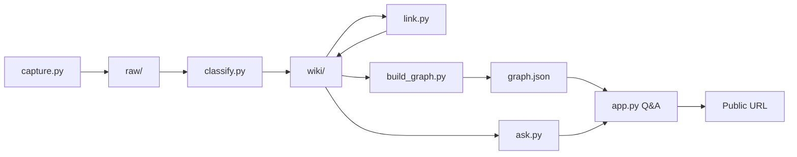
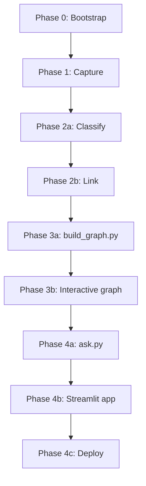

# SecondSelf — Phase-Wise Implementation Plan

This document is the step-by-step build guide for **SecondSelf**. It translates [Problem_Statement.md](./Problem_Statement.md) and [ARCHITECTURE.md](./ARCHITECTURE.md) into actionable tasks across four phases (weeks). Each phase ships a working milestone that becomes input for the next.

---

## Overview

| Phase | Name | Badge | Primary Output |
|-------|------|-------|----------------|
| 0 | Project Bootstrap | — | Repo, env, folder skeleton |
| 1 | The Archivist | 🏆 The Archivist | `capture.py` + populated `raw/` |
| 2 | The Librarian | 🏆 The Librarian | `classify.py`, `link.py` + organized `wiki/` |
| 3 | The Cartographer | 🏆 The Cartographer | `build_graph.py` + interactive graph |
| 4 | The Oracle | 🏆 The Oracle | `ask.py`, `app.py` + public URL |

**End-to-end pipeline:**

```
capture → classify → link → build_graph → ask → deploy
```

**Rule for every phase:** Test on **real personal data** (your own notes, links, files) — not dummy/test fixtures.

---

## Phase 0 — Project Bootstrap (Day 0)

**Goal:** A runnable Python project with the correct folder layout and dependencies, ready for Week 1 coding.

### Tasks

#### 0.1 Initialize repository

- [ ] Create or clone the GitHub repo (`secondself`)
- [ ] Add `.gitignore` entries for:
  - `.env`
  - `__pycache__/`, `*.pyc`, `.venv/`
  - `wiki/.index/` (embeddings — large, regeneratable)
  - Optionally `raw/` and `wiki/` if notes are private (commit sanitized demo data for deployment separately)

#### 0.2 Create folder structure

```bash
mkdir -p raw wiki/Projects wiki/Areas wiki/Resources wiki/Archives wiki/.index data static
touch raw/.gitkeep wiki/.gitkeep
```

Expected layout after bootstrap:

```text
secondself/
├── raw/
├── wiki/
│   ├── Projects/
│   ├── Areas/
│   ├── Resources/
│   ├── Archives/
│   └── .index/
├── data/
├── static/
├── capture.py          # Phase 1
├── classify.py         # Phase 2
├── link.py             # Phase 2
├── build_graph.py      # Phase 3
├── ask.py              # Phase 4
├── app.py              # Phase 4
├── requirements.txt
├── .env.example
└── README.md
```

#### 0.3 Set up Python environment

```bash
python -m venv .venv
# Windows
.venv\Scripts\activate
# macOS/Linux
source .venv/bin/activate

pip install -r requirements.txt
```

**Phase 0 `requirements.txt` (minimal — expand each phase):**

```text
python-dotenv>=1.0
requests>=2.31
```

#### 0.4 Shared configuration (optional but recommended)

Create `config.py` early so all phases share paths and constants:

```python
from pathlib import Path

ROOT = Path(__file__).parent
RAW_DIR = ROOT / "raw"
WIKI_DIR = ROOT / "wiki"
DATA_DIR = ROOT / "data"
GRAPH_JSON = DATA_DIR / "graph.json"
EMBEDDINGS_PATH = WIKI_DIR / ".index" / "embeddings.pkl"
NOTE_REGISTRY = WIKI_DIR / ".index" / "note_registry.json"

PARA_FOLDERS = ["Projects", "Areas", "Resources", "Archives"]
SIMILARITY_THRESHOLD = 0.75
TOP_K_LINKS = 5
EMBEDDING_MODEL = "all-MiniLM-L6-v2"
```

#### 0.5 Documentation stub

- [ ] Update `README.md` with project description, setup steps, and phase roadmap
- [ ] Add `.env.example`:

```text
GROQ_API_KEY=your_key_here
```

### Phase 0 Exit Criteria

- [ ] Virtual environment activates and Python 3.10+ runs
- [ ] All folders exist (`raw/`, `wiki/` with PARA subfolders, `data/`, `static/`)
- [ ] Repo pushed to GitHub (public)

**Estimated time:** 1–2 hours

---

## Phase 1 — The Archivist: Capture Pipeline (Week 1)

**Goal:** One CLI command captures any note, link, or file into `raw/` with a timestamp and unique ID.

**Badge:** 🏆 The Archivist

### 1.1 Define the raw capture schema

Implement the folder-per-capture pattern from ARCHITECTURE.md:

```text
raw/{capture_id}/
├── meta.json
└── content.md   (or original file copy)
```

**`meta.json` fields:**

| Field | Required | Description |
|-------|----------|-------------|
| `id` | Yes | `{YYYYMMDD_HHMMSS}_{6-char-uuid}` |
| `timestamp` | Yes | ISO 8601 with timezone |
| `type` | Yes | `note`, `link`, or `file` |
| `source` | Yes | `cli` (later: `streamlit`) |
| `original_filename` | No | For file captures |
| `content_path` | Yes | Relative path to content inside capture folder |

### 1.2 Implement `capture.py`

**Step-by-step implementation order:**

| Step | Function | Description |
|------|----------|-------------|
| 1 | `generate_capture_id()` | Timestamp + short UUID |
| 2 | `write_meta()` | Serialize and write `meta.json` |
| 3 | `capture_note(text)` | Write text to `content.md` |
| 4 | `capture_link(url)` | Store URL; optionally fetch title/excerpt via `requests` |
| 5 | `capture_file(path)` | Copy file into capture folder; extract text for PDFs if using `pypdf` |
| 6 | `capture(type, content)` | Unified entry point returning capture ID |
| 7 | CLI with `argparse` | Mutually exclusive `--note`, `--link`, `--file` |

**CLI interface:**

```bash
python capture.py --note "Idea about RAG pipelines"
python capture.py --link "https://example.com/article"
python capture.py --file "./documents/report.pdf"
```

**Design constraints (from architecture):**

- Raw layer is **append-only** — never modify existing captures
- Each capture is self-contained in its own folder
- Print capture ID on success for traceability

### 1.3 Add dependencies

Add to `requirements.txt`:

```text
pypdf>=3.0          # optional: PDF text extraction
```

### 1.4 Testing & validation

**Manual test checklist:**

- [ ] Capture a plain-text note → verify `meta.json` + `content.md`
- [ ] Capture a URL → verify URL stored; optional fetch metadata
- [ ] Capture a PDF or image file → verify file copied + metadata
- [ ] Confirm every capture has unique ID and valid ISO timestamp
- [ ] Capture 10+ **real** items from your scattered notes/bookmarks/files

**Suggested real capture mix (minimum 10):**

| # | Type | Example |
|---|------|---------|
| 1–3 | Notes | Ideas, meeting notes, todos |
| 4–6 | Links | Articles, docs, GitHub repos |
| 7–10 | Files | PDF, markdown, screenshot |

### Phase 1 Deliverables

| Artifact | Path |
|----------|------|
| Capture script | `capture.py` |
| Raw captures | `raw/{id}/` (10+ real items) |
| Empty wiki scaffold | `wiki/` (PARA folders ready for Phase 2) |

### Phase 1 Acceptance Criteria

- [ ] `raw/` and `wiki/` folder structure exists
- [ ] One command captures a note, a link, AND a file
- [ ] Every capture has a timestamp + unique ID
- [ ] 10+ real items captured

**Estimated time:** 4–8 hours

**Depends on:** Phase 0 complete

**Feeds into:** Phase 2 (`classify.py` reads from `raw/`)

---

## Phase 2 — The Librarian: Self-Organizing Wiki (Week 2)

**Goal:** Auto-classify raw captures with PARA + tags + summary, then auto-link related notes using embeddings.

**Badge:** 🏆 The Librarian

### 2.1 Prerequisites

- [ ] Sign up for [Groq](https://console.groq.com/) and obtain API key
- [ ] Add `GROQ_API_KEY` to `.env`
- [ ] Install Phase 2 dependencies:

```text
groq>=0.4
sentence-transformers>=2.2
numpy>=1.24
scikit-learn>=1.3
python-frontmatter>=1.0
```

### 2.2 Implement `classify.py` (Auto-Classify)

**Step-by-step implementation order:**

| Step | Function | Description |
|------|----------|-------------|
| 1 | `list_unprocessed_captures()` | Scan `raw/`; skip captures already in wiki or marked processed |
| 2 | `read_capture(capture_id)` | Load `meta.json` + content |
| 3 | `build_classification_prompt(content)` | System + user prompt with PARA schema |
| 4 | `call_groq(prompt)` | Use `llama-3.1-8b-instant` (or current free model) |
| 5 | `parse_llm_response(text)` | Extract JSON; retry on malformed output (max 2 retries) |
| 6 | `write_wiki_note(capture, classification)` | Write markdown with YAML frontmatter to `wiki/{PARA}/` |
| 7 | `mark_capture_processed(capture_id)` | Update meta or move to `raw/.processed/` |
| 8 | `classify_all_unprocessed()` | Batch entry point |

**Wiki note frontmatter template:**

```yaml
---
id: {capture_id}
para: Projects | Areas | Resources | Archives
tags: [tag1, tag2]
summary: One-line summary
created: {ISO timestamp from capture}
links: []
---
```

**Slug generation:** Derive filename from summary or first line (sanitized, lowercase, hyphenated).

**LLM prompt (minimum viable):**

```
System: Classify the following content using PARA (Projects, Areas, Resources, Archives).
Return ONLY valid JSON: {"para": "...", "tags": ["..."], "summary": "..."}

User: {capture_content}
```

### 2.3 Implement `link.py` (Auto-Link)

**Step-by-step implementation order:**

| Step | Function | Description |
|------|----------|-------------|
| 1 | `load_embedding_model()` | Lazy-load `all-MiniLM-L6-v2` |
| 2 | `embed_text(text)` | Return numpy vector |
| 3 | `load_embedding_index()` | Load or init `wiki/.index/embeddings.pkl` |
| 4 | `save_embedding_index(index)` | Persist vectors + note ID mapping |
| 5 | `find_related(note_id, top_k, threshold)` | Cosine similarity via scikit-learn |
| 6 | `update_note_links(note_path, linked_ids)` | Write `links:` to frontmatter |
| 7 | `link_note(note_id)` | Embed note → find matches → update frontmatter |
| 8 | `process_all_notes()` | Rebuild index and links for entire wiki |

**Linking rules:**

- Compare each note against all **other** notes (exclude self)
- Link when cosine similarity ≥ `0.75` (tune between 0.72–0.80 on real data)
- Cap at `TOP_K = 5` links per note
- Prefer bidirectional links (update both notes' frontmatter)

### 2.4 Pipeline script for Phase 2

Create a simple runner (or add to future `pipeline.py`):

```bash
python classify.py          # raw → wiki
python link.py                # embeddings + auto-links
```

### 2.5 Testing & validation

- [ ] Classify all Phase 1 captures → notes appear in correct PARA folders
- [ ] Spot-check 5 notes: PARA category makes sense, tags relevant, summary accurate
- [ ] Run linking → at least some notes have `links:` populated
- [ ] Manually verify 2–3 auto-links: related content is genuinely related
- [ ] Process **15+ real items** total (capture more in Phase 1 if needed)

**Common issues & fixes:**

| Issue | Fix |
|-------|-----|
| LLM returns invalid JSON | Add retry; strip markdown code fences from response |
| Too many/few links | Adjust `SIMILARITY_THRESHOLD` |
| Slow first embed | Model downloads once; subsequent runs are fast |
| Duplicate wiki notes | Check processed-marker logic before re-running classify |

### Phase 2 Deliverables

| Artifact | Path |
|----------|------|
| Classification script | `classify.py` |
| Linking script | `link.py` |
| Organized wiki | `wiki/{PARA}/*.md` |
| Embeddings index | `wiki/.index/embeddings.pkl` |
| Note registry | `wiki/.index/note_registry.json` |

### Phase 2 Acceptance Criteria

- [ ] Any raw capture → category + tags + summary automatically
- [ ] PARA categorization working
- [ ] Embeddings computed per note
- [ ] Related notes auto-linked (no manual tagging)
- [ ] Runs on 15+ real items → organized `wiki/`

**Estimated time:** 8–12 hours

**Depends on:** Phase 1 (`raw/` with 10+ captures; recommend 15+ before linking)

**Feeds into:** Phase 3 (`build_graph.py` reads `wiki/`)

---

## Phase 3 — The Cartographer: Living Brain Graph (Week 3)

**Goal:** Convert the linked wiki into `graph.json` and render an interactive force-directed graph with hover, drag, and zoom.

**Badge:** 🏆 The Cartographer

### 3.1 Implement `build_graph.py`

**Step-by-step implementation order:**

| Step | Function | Description |
|------|----------|-------------|
| 1 | `scan_wiki_notes(wiki_dir)` | Glob all `*.md` under PARA folders |
| 2 | `parse_wiki_note(path)` | Use `python-frontmatter` to extract metadata + body |
| 3 | `note_to_node(note)` | Build node dict: id, label, para, tags, content_preview |
| 4 | `links_to_edges(note)` | Convert frontmatter `links` to edge list with optional weight |
| 5 | `build_graph(wiki_dir)` | Assemble nodes + edges; deduplicate edges |
| 6 | `export_graph(graph, output_path)` | Write pretty-printed JSON to `data/graph.json` |

**Node schema:**

```json
{
  "id": "20250728_143022_a1b2c3",
  "label": "One-line summary",
  "para": "Resources",
  "tags": ["python", "ml"],
  "content_preview": "First 200 chars of body...",
  "group": "Resources"
}
```

**Edge schema:**

```json
{
  "source": "note_id_a",
  "target": "note_id_b",
  "weight": 0.87,
  "type": "semantic_similarity"
}
```

**CLI:**

```bash
python build_graph.py
# Output: data/graph.json
```

### 3.2 Build interactive graph component

**Option A (recommended):** vis-network embedded in HTML template

Create `static/graph.html` or an inline HTML generator function used by Streamlit later.

**Features to implement:**

| Feature | Implementation |
|---------|----------------|
| Force-directed layout | vis-network physics engine |
| Node color by PARA | `group` field → color map |
| Hover popup | Show summary, tags, content preview |
| Drag | Built into vis-network |
| Zoom / pan | Built into vis-network |
| Alive feel | Optional: pulse animation on nodes |

**PARA color map (example):**

| PARA | Color |
|------|-------|
| Projects | `#FF6B6B` |
| Areas | `#4ECDC4` |
| Resources | `#45B7D1` |
| Archives | `#96CEB4` |

### 3.3 Standalone graph preview (before Streamlit)

Test the graph without the full app:

```python
# quick test: generate HTML file and open in browser
python build_graph.py
# Open static/graph_preview.html or serve locally
```

Alternatively, prototype the graph inside a minimal `app.py` stub (completed in Phase 4).

### 3.4 Testing & validation

- [ ] `data/graph.json` contains one node per wiki note
- [ ] Edges match `links` in note frontmatter
- [ ] Graph renders in browser from real data (not dummy nodes)
- [ ] Hover shows note content preview
- [ ] Drag and zoom work smoothly
- [ ] Graph remains usable with 15+ nodes (performance baseline)

### Phase 3 Deliverables

| Artifact | Path |
|----------|------|
| Graph builder | `build_graph.py` |
| Graph data | `data/graph.json` |
| Graph HTML/JS | `static/graph.html` or inline component |

### Phase 3 Acceptance Criteria

- [ ] Script builds nodes + edges from notes and exports clean JSON
- [ ] Interactive force-directed graph renders from that JSON
- [ ] Hover reveals note content
- [ ] Drag + zoom work
- [ ] Built from your real notes, not dummy data

**Estimated time:** 6–10 hours

**Depends on:** Phase 2 (`wiki/` with linked notes)

**Feeds into:** Phase 4 (graph embedded in Streamlit `app.py`)

---

## Phase 4 — The Oracle: RAG + Streamlit + Deployment (Week 4)

**Goal:** Answer questions from your own notes via RAG, assemble the full Streamlit UI, and deploy to a public URL.

**Badge:** 🏆 The Oracle

### 4.1 Implement `ask.py` (Retrieval-Augmented Q&A)

**Step-by-step implementation order:**

| Step | Function | Description |
|------|----------|-------------|
| 1 | `load_wiki_notes()` | Index note ID → path + content |
| 2 | `retrieve(question, top_k=5)` | Embed question; cosine similarity against embedding index |
| 3 | `build_context(retrieved_notes)` | Concatenate note bodies with IDs for citation |
| 4 | `synthesize_answer(question, context)` | Groq LLM with grounded prompt |
| 5 | `ask(question)` | Returns `Answer(text, sources, confidence)` |

**RAG prompt template:**

```
You answer questions using ONLY the provided notes.
If the notes don't contain enough information, say so clearly.
Cite note IDs when referencing specific facts.

Notes:
---
{note_1_id}: {note_1_body}
---
{note_2_id}: {note_2_body}
---

Question: {question}
```

**CLI for testing (before UI):**

```bash
python ask.py "What have I captured about machine learning?"
```

### 4.2 Test RAG with real questions

Write 5–10 questions you can answer from your own captures:

| Question type | Example |
|---------------|---------|
| Factual | "What links did I save about Python?" |
| Thematic | "What projects am I working on?" |
| Synthesis | "Summarize my notes on AI embeddings" |
| Negative | "What do I know about quantum computing?" (should say insufficient info if none captured) |

**Validation:**

- [ ] Answers reference content actually in your wiki
- [ ] Source note IDs are returned and correct
- [ ] Hallucination minimized — LLM says "I don't know" when retrieval is empty

### 4.3 Implement `app.py` (Streamlit UI)

**Layout (top to bottom):**

1. **Header** — "SecondSelf — Your Personal AI Second Brain"
2. **Ask bar** — text input + submit button → calls `ask()`
3. **Answer panel** — synthesized answer + linked source note IDs
4. **Graph** — `st.components.v1.html()` rendering vis-network from `data/graph.json`
5. **Sidebar** — stats (note count, link count), optional capture form, "Rebuild pipeline" button

**Step-by-step UI implementation order:**

| Step | Component | Description |
|------|-----------|-------------|
| 1 | Page config | Title, wide layout, sidebar |
| 2 | Load graph JSON | Cache with `@st.cache_data` |
| 3 | Graph component | Embed vis-network HTML |
| 4 | Ask form | Wire to `ask()` with loading spinner |
| 5 | Answer display | Show text + expandable sources |
| 6 | Sidebar stats | Count nodes/edges from graph.json |
| 7 | Pipeline refresh | Button runs classify → link → build_graph |

**Add to `requirements.txt`:**

```text
streamlit>=1.28
```

**Run locally:**

```bash
streamlit run app.py
```

### 4.4 Implement `pipeline.py` (optional orchestrator)

Unify all processing stages:

```python
def run_full_pipeline():
    classify_all_unprocessed()
    process_all_notes()      # link.py
    build_graph()            # build_graph.py
```

Wire this to the Streamlit sidebar "Refresh brain" button.

### 4.5 Deployment

**Platform:** Streamlit Cloud (primary) or Hugging Face Spaces (alternative)

**Pre-deployment checklist:**

- [ ] Pin all dependency versions in `requirements.txt`
- [ ] `app.py` is the entry point
- [ ] Commit `data/graph.json` and wiki notes (sanitized if public)
- [ ] Pre-compute `wiki/.index/embeddings.pkl` to reduce cold start (or lazy-load with spinner)
- [ ] Set `GROQ_API_KEY` in platform secrets (never in repo)
- [ ] Test full flow locally one final time

**Streamlit Cloud steps:**

1. Push repo to GitHub
2. Go to [share.streamlit.io](https://share.streamlit.io)
3. Connect repo → set main file `app.py`
4. Add secret: `GROQ_API_KEY`
5. Deploy → copy public URL

**Post-deployment verification:**

- [ ] Public URL loads without errors
- [ ] Graph renders with real nodes
- [ ] Ask bar returns answers from your notes
- [ ] Cold start acceptable (< 60s with pre-built embeddings)

### 4.6 Final README & repo polish

- [ ] Setup instructions (venv, `.env`, run commands)
- [ ] Architecture overview (link to `ARCHITECTURE.md`)
- [ ] Live demo URL
- [ ] Screenshot of graph + ask UI
- [ ] Privacy note: Groq API usage, public deployment considerations

### Phase 4 Deliverables

| Artifact | Path |
|----------|------|
| RAG module | `ask.py` |
| Streamlit app | `app.py` |
| Pipeline orchestrator | `pipeline.py` |
| Live deployment | Public URL |
| Polished README | `README.md` |

### Phase 4 Acceptance Criteria

- [ ] `ask()` returns answers synthesized from your own notes (retrieval + LLM)
- [ ] One Streamlit app contains both the graph and the search bar
- [ ] Deployed live with a public URL
- [ ] Full pipeline works end to end in the deployed app

**Estimated time:** 10–14 hours

**Depends on:** Phases 1–3 complete

---

## Final Integration Checklist

Verify the complete system end to end:



### End-to-end test script

| Step | Action | Expected result |
|------|--------|-----------------|
| 1 | `python capture.py --note "Test E2E note about deployment"` | New folder in `raw/` |
| 2 | `python classify.py` | New note in `wiki/{PARA}/` |
| 3 | `python link.py` | Note has links; index updated |
| 4 | `python build_graph.py` | `data/graph.json` updated with new node |
| 5 | `python ask.py "What do I know about deployment?"` | Answer cites the new note |
| 6 | Open deployed URL → ask same question | Same answer on live app |

### Project-wide deliverables

- [ ] Public GitHub repo with clean `README.md` + setup instructions
- [ ] Live deployed URL — interactive graph + ask-your-brain search
- [ ] End-to-end flow verified: capture → classify → link → graph → ask
- [ ] All 4 weekly milestones complete

---

## Dependency Graph



**Critical path:** Bootstrap → Capture → Classify → Link → Graph JSON → Graph UI → RAG → Deploy

**Parallelizable work:**

- Phase 3 graph HTML prototype can start once 5+ linked notes exist (before full 15+)
- Phase 4 `ask.py` can be built as soon as embeddings index exists (parallel with graph UI)
- README and screenshots can be drafted during Phase 3

---

## Time Budget Summary

| Phase | Estimated hours | Cumulative |
|-------|-----------------|------------|
| Phase 0 — Bootstrap | 1–2 | 1–2 |
| Phase 1 — Capture | 4–8 | 5–10 |
| Phase 2 — Classify + Link | 8–12 | 13–22 |
| Phase 3 — Graph | 6–10 | 19–32 |
| Phase 4 — RAG + Deploy | 10–14 | 29–46 |

**Total:** ~30–46 hours over 4 weeks (~7–12 hours/week)

---

## Risk Register

| Risk | Phase | Mitigation |
|------|-------|------------|
| Groq API rate limits | 2, 4 | Batch classify; add retry with backoff |
| LLM returns bad JSON | 2 | Retry prompt; strip code fences; validate schema |
| Too many/few auto-links | 2 | Tune `SIMILARITY_THRESHOLD` on real data |
| Slow Streamlit cold start | 4 | Pre-commit embeddings; lazy-load model |
| Private notes on public deploy | 4 | Use sanitized demo wiki or accept public data |
| PDF text extraction fails | 1 | Fall back to filename-only capture; note in README |
| Empty graph | 3 | Run `build_graph.py` after linking; verify paths |
| RAG hallucination | 4 | Ground prompt; show sources; low retrieval → honest answer |

---

## Quick Reference — Commands by Phase

```bash
# Phase 0
python -m venv .venv && pip install -r requirements.txt

# Phase 1
python capture.py --note "Your idea here"
python capture.py --link "https://example.com"
python capture.py --file "./doc.pdf"

# Phase 2
python classify.py
python link.py

# Phase 3
python build_graph.py

# Phase 4
python ask.py "Your question here"
streamlit run app.py

# Full pipeline (after Phase 4)
python pipeline.py
```

---

## Related Documents

- [Problem_Statement.md](./Problem_Statement.md) — Project goals, weekly problem statements, acceptance criteria
- [ARCHITECTURE.md](./ARCHITECTURE.md) — System design, data models, component interfaces, deployment architecture

---

*Start with Phase 0, ship Phase 1 by end of Week 1, and never skip testing on real data.*
